# MLflow 多來源檢索評估（Databricks Vector Search）

這個專案的最主要成果是「**檢索/推薦品質評估報告**」。其餘程式碼與 setup 主要用於重現評估流程；若你只關心結論與數據，可以直接閱讀下方報告。

---

## 目錄

- [評估報告](#評估報告)
- [如何重現評估（可選）](#如何重現評估可選)
- [專案結構（簡述）](#專案結構簡述)

---

## 評估報告

### 摘要（TL;DR）

本報告評估多種檢索策略（ANN / FULL_TEXT / HYBRID）在繁體中文語料上的表現，並比較三個關鍵決策點：**baseline 問題**、**改用 Gemini embeddings 的改善幅度**、以及 **reranker 的品質/延遲權衡**。

- **Baseline 的核心問題**：ANN 幾乎失效，分數貼近下限（Intent Fit **1.20**、Engagement **1.30**），實務上只能依賴 FULL_TEXT 才比較「看起來合理」。
- **改用 `gemini-embedding-001` 後**：HYBRID 的提升最大，多數維度提升 **+0.7 ~ +1.3**（例如 Diversity **+1.30**、Engagement **+1.10**）；FULL_TEXT 則多為小幅提升（約 **+0.1 ~ +0.2**）或持平。
- **Reranker 的代價過高**：對 FULL_TEXT 確有小幅提升（Engagement **+0.20**、Ranking **+0.30**），但延遲上升 **4.5× ~ 5.6×**；對 HYBRID 的收益不穩定（Engagement **-0.30**，Ranking **+0.00**）。
- **結論**：若以品質為優先，建議採用 **`baseline_gemini_HYBRID_no_rerank`**；若以延遲為優先，採用 **`baseline_gemini_FULL_TEXT_no_rerank`** 也能取得穩定可用的結果。**不建議加入 reranker**（目前的收益不足以抵銷延遲成本）。

---

### 背景與目標

本專案的目標是提升文章的推薦品質：讓結果**更符合意圖、排序更合理、且不被關鍵字誤導**。  
我們的文章推薦方式為使用文章標題作為 query，透過 Databricks Vector Search 至文章資料庫中尋找相似語意的內容，由此生成推薦文章。  
為評估結果品質，我們使用 LLM Judge 對每個 query 的結果進行打分，並觀察不同 indexing / search 策略的表現。

---

### 評估方法（LLM Judge Criteria）

為了讓檢索品質的評估更一致，我們使用 LLM Judge 針對**每種檢索策略所回傳的結果**，逐一對每個 query 進行打分。

Judge 的評分維度如下：

1) **Intent Fit（意圖吻合度）**
- 檢索結果是否直接回應使用者「明確表達」的意圖？
- 會扣分的典型情況：**只有關鍵字吻合，但主題不對**。

2) **Latent Interest Match（命中隱含關切）**
- 除了字面關鍵字外，結果是否命中使用者**真正想要達成／了解／決策**的需求？
- 會加分的典型情況：能涵蓋隱含限制、取捨（trade-offs）、或使用者可能在意的後續問題。

3) **Engagement（吸睛但不誤導）**
- 結果是否因為**相關且切題**而讓人願意點擊／閱讀？
- 會扣分的典型情況：標題黨／吸睛但誤導。

4) **Diversity（多樣性/互補性）**
- 在同一份結果列表中，內容是否能提供互補視角，而不是一直重複同一件事？
- 會加分的典型情況：**不同角度但都有效**的覆蓋。

5) **Ranking（排序品質：依你定義的價值排序）**
- 是否把更有價值、更切題的結果排在前面？
- 會扣分的典型情況：最佳結果被埋在後面，前面都是較弱的匹配。

另外我們也追蹤一個輔助維度：

6) **Credibility（可信度/可核實性）**
- 結果是否看起來更可靠、可核實（不明顯錯誤或誤導）？

**分數範圍**：1–5，其中 **1 = 很差**、**3 = 勉強可接受／好壞參半**、**5 = 很好**。下方圖表呈現的是在評估 query 集上的**平均分數（mean）**。

---

### Baseline 問題：關鍵字命中但語意不對（以及 ANN 幾乎失效）

Baseline 的表現比預期更差，特別是在 **vector（ANN）檢索**這條路徑上。實務上，只有 **full-text search** 的結果比較穩定地「看起來合理」。

即使使用 full-text search，我們仍然觀察到一些 edge case：某些文章主要是因為包含重疊關鍵字而被取回，但其**實際主題**並不符合 query 的意圖（典型的「關鍵字重疊 ≠ 語意相關」失敗模式）。

舉例來說：

```
query: "除了心理層面，過度沉浸短影音可能對大腦功能造成哪些具體影響？"

results:
- 文章1: "YouTube、TikTok 刷不停？研究揭示短影音如何「悄悄毀掉」你的大腦功能"
- 文章2: "台灣人神級改建「全美最大屋頂花園」，郵局變休士頓最夯夜店"
- 文章3: "短影音成癮警訊！報告：逾7成台灣民眾曾看短影音，近半數人每天看數次"
- 文章4: "短影音的影響與衝擊：它不只偷走時間，更讓孩子嚴重成癮"
- 文章5: "未來的網際網路為何被稱為《沉浸式經濟》？元宇宙是什麼？區塊鏈是什麼？"
```

文章 2 明顯與 query 無關，但因為其內容含有多次 "沉浸" 這個關鍵字，所以被取回；且因為出現多次而被排到第二名。並非所有 query 會有這種情況，但只要出現就會嚴重影響使用者體驗。

#### Baseline（mean）結果


| Intent Fit（意圖吻合度） | Engagement（吸睛但不誤導） |
| --- | --- |
| 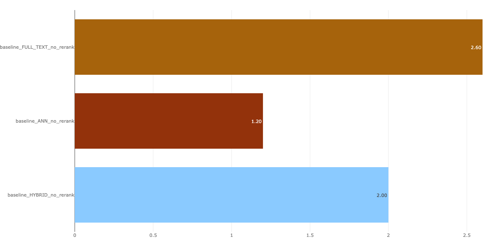 | 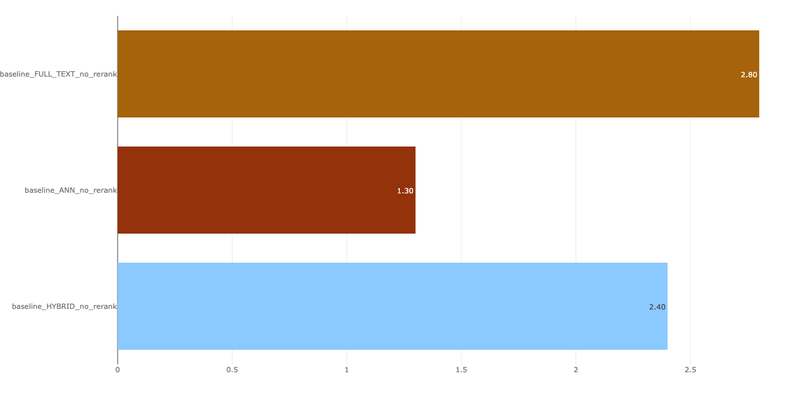 |

為了更直觀地量化差距，從圖上讀到的 mean 分數如下：

| 方法 | Intent Fit（mean） | Engagement（mean） |
| --- | ---: | ---: |
| baseline_FULL_TEXT_no_rerank | 2.60 | 2.80 |
| baseline_HYBRID_no_rerank | 2.00 | 2.40 |
| baseline_ANN_no_rerank | 1.20 | 1.30 |

**關鍵觀察**：ANN 這條路徑的分數幾乎貼近下限（Intent Fit 1.20、Engagement 1.30）。這強烈暗示 baseline 的 embedding 訊號幾乎沒有提供有效的語意檢索能力——以 judge 的標準來看，表現接近隨機。

---

### 改用 Gemini embeddings：語言匹配帶來最大槓桿

我們的主要假設是：**語言不匹配（language mismatch）**。

- 內容與 query 主要是**繁體中文**。
- 我們使用的 Databricks embedding 模型是 `databricks-gte-large-en` / `databricks-bge-large-en`。
- `-en` 後綴代表模型偏向**英文**，在繁體中文上 embedding 品質可能會顯著下降（包含 tokenization 行為與語意空間對齊都可能變差）。

Databricks-managed embeddings 的優點是方便（幾乎不用寫額外的 embedding 程式碼），但語言支援的限制很可能主導了結果。因此我們改用**自訂 embedding 模型**，並且選擇明確支援繁體中文的模型：

- Model: `gemini-embedding-001`
- Reference: [Link](https://docs.cloud.google.com/vertex-ai/generative-ai/docs/model-reference/text-embeddings-api#supported_text_languages)

上述文件明確指出支援 Traditional Chinese。

#### Gemini embeddings（mean）結果

切換 embedding 後，各個維度的檢索品質都有明顯提升（以下為 judge 平均分數 mean）。其中 **baseline_gemini_HYBRID_no_rerank** 在多數維度可到 3 分以上；FULL_TEXT 則是穩定小幅上升。


| Intent Fit（意圖吻合度） | Latent Interest Match（命中隱含關切） |
| --- | --- |
| 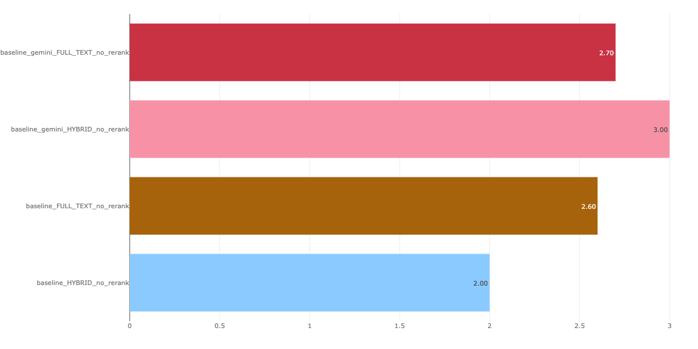 | 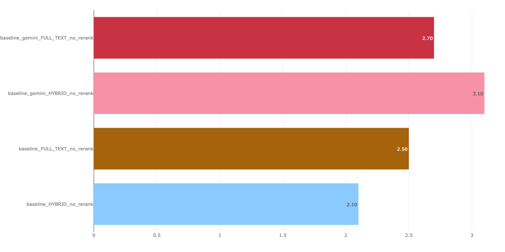 |
| Engagement（吸睛但不誤導） | Diversity（多樣性/互補性） |
| 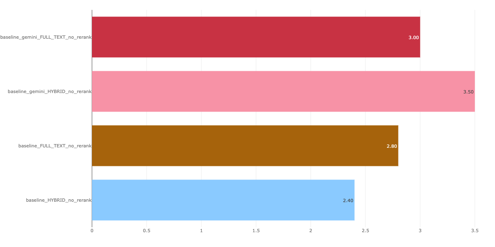 | 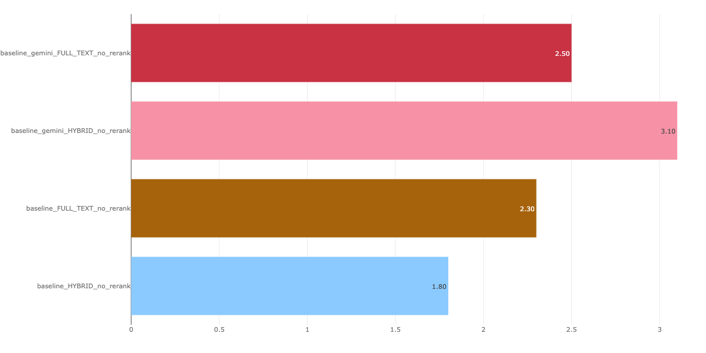 |
| Ranking（排序品質） | Credibility（可信度/可核實性） |
| 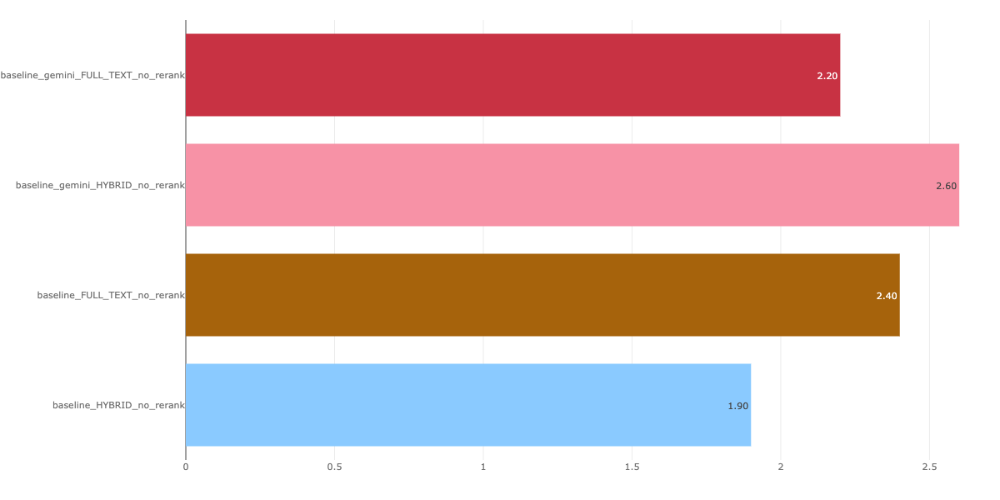 | 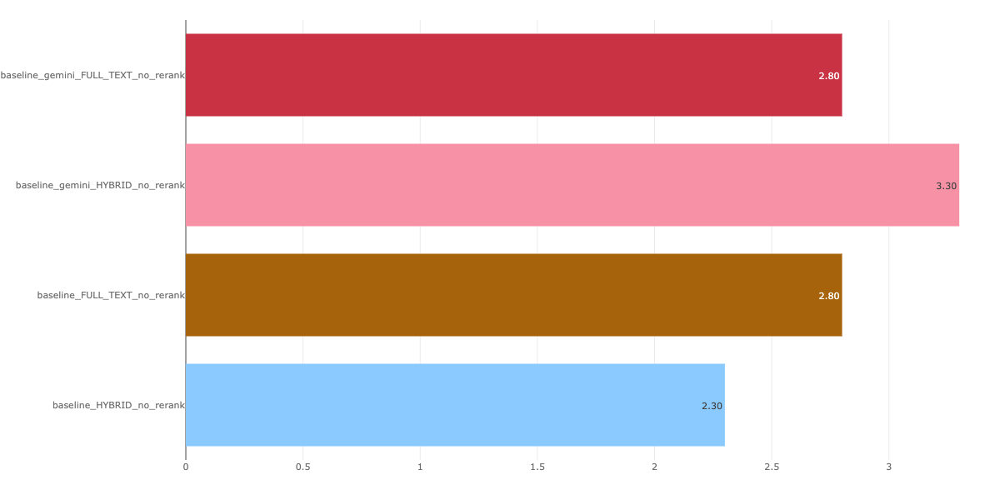 |

同樣從圖上讀取到的 mean 分數（並附上相對於 baseline 的差值）：

| 維度 | baseline_FULL_TEXT | gemini_FULL_TEXT | 差值 | baseline_HYBRID | gemini_HYBRID | 差值 |
| --- | ---: | ---: | ---: | ---: | ---: | ---: |
| Intent Fit | 2.60 | 2.70 | +0.10 | 2.00 | 3.00 | +1.00 |
| Latent Interest Match | 2.50 | 2.70 | +0.20 | 2.10 | 3.10 | +1.00 |
| Engagement | 2.80 | 3.00 | +0.20 | 2.40 | 3.50 | +1.10 |
| Diversity | 2.30 | 2.50 | +0.20 | 1.80 | 3.10 | +1.30 |
| Ranking | 2.40 | 2.20 | -0.20 | 1.90 | 2.60 | +0.70 |
| Credibility | 2.80 | 2.80 | +0.00 | 2.30 | 3.30 | +1.00 |

量化結論（以 mean 分數觀察）：

- **HYBRID 的提升幅度最大**：多數維度落在 **+0.7 ~ +1.3**（例如 Diversity +1.30、Engagement +1.10、Intent/Latent 各 +1.00）。
- **FULL_TEXT 是小幅提升或持平**：多數維度約 **+0.1 ~ +0.2**，Credibility 持平；但 **Ranking 反而 -0.20**，代表「改 embedding」沒有提升排序品質，這是因為 FULL_TEXT Search 是只有參考字串，尋找字串比對分數最高的，而非參考 vector search 的語意相似度。

#### 為什麼這樣改會有效（Interpretation）

- **Intent Fit / Latent Interest Match**：更好的 embedding 讓繁體中文 query 與文件能落在更一致的語意空間，減少「只靠關鍵字」的匹配，提升真正的主題對齊。
- **Ranking**：當語意相似度變得有意義後，ANN（以及任何 hybrid 混合分數）用來排序的訊號更強，Top results 更容易把好結果排到前面。
- **Diversity**：語意品質提升後，較不容易因為共享關鍵字而取回一堆近似重複的內容，能更容易撈到多個「都相關但角度不同」的群集。

---

### 是否加入 reranker：品質提升有限，但延遲成本極高

Databricks 提供內建的 reranker 功能：根據額外的 ranking criteria 或 reranker model 來重新排序結果。使用 cross-encoder models（如 mxbai-rerank、ColBERTv2）理論上可以提升檢索品質，但代價是額外延遲，因此需要權衡。

#### 品質影響（mean）


| Engagement（吸睛但不誤導） | Ranking（排序品質） |
| --- | --- |
| 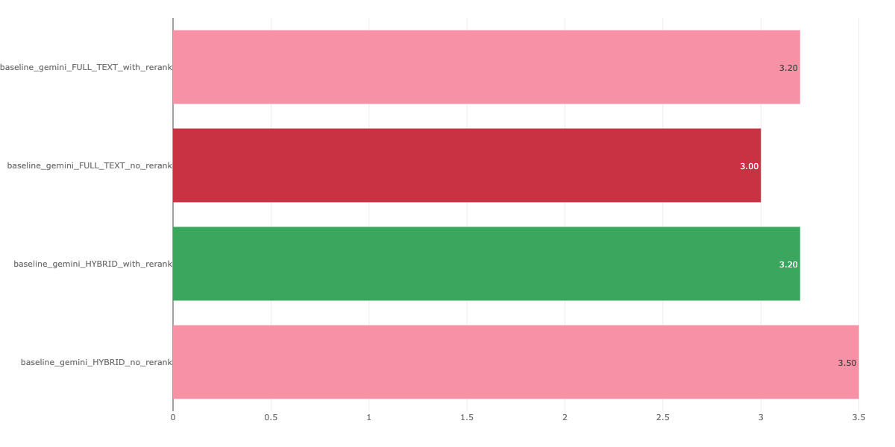 | 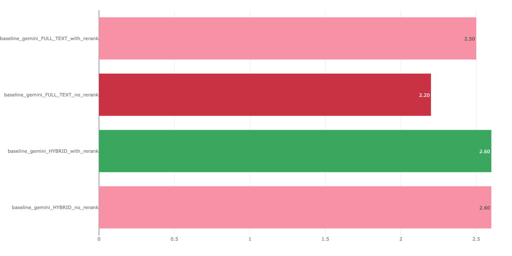 |

從圖上讀取到的 mean 分數如下（with vs no rerank）：

| 方法 | Engagement（mean） | 差值 | Ranking（mean） | 差值 |
| --- | ---: | ---: | ---: | ---: |
| gemini_FULL_TEXT_no_rerank → with_rerank | 3.00 → 3.20 | +0.20 | 2.20 → 2.50 | +0.30 |
| gemini_HYBRID_no_rerank → with_rerank | 3.50 → 3.20 | -0.30 | 2.60 → 2.60 | +0.00 |

量化解讀：

- **FULL_TEXT**：reranker 在 Engagement（+0.20）與 Ranking（+0.30）都有可見提升。
- **HYBRID**：Ranking 幾乎沒變（+0.00），且 Engagement 反而下降（-0.30），代表 reranker 的收益並不穩定、會因策略不同而有差異。

#### 延遲影響（mean）


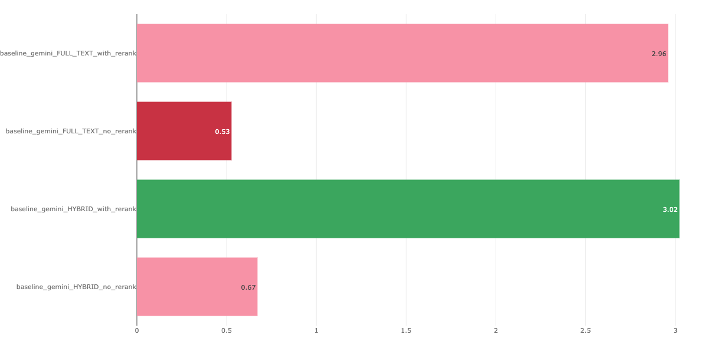

從圖上讀取到的 mean latency（秒）如下：

| 方法 | no rerank（s） | with rerank（s） | 增加（s） | 倍數 |
| --- | ---: | ---: | ---: | ---: |
| gemini_FULL_TEXT | 0.53 | 2.96 | +2.43 | 5.6× |
| gemini_HYBRID | 0.67 | 3.02 | +2.35 | 4.5× |

這個延遲增加來自「多一個 re-ranking 階段」：需要對候選結果做額外的模型推論/打分，再重新排序後回傳。

---

### 結論與建議

綜合 mean 分數與延遲的量化結果，本報告的結論與建議如下：

1) **先把 embedding 語言匹配做好，是最有槓桿的改善**  
   `gemini-embedding-001` 讓 HYBRID 的多數維度直接提升到更可用的區間（多數維度 +0.7 ~ +1.3）。

2) **不建議加入 reranker（目前）**  
   雖然 FULL_TEXT 有小幅品質提升（Engagement +0.20、Ranking +0.30），但延遲增加 **4.5× ~ 5.6×**，且在 HYBRID 上收益不穩定，整體不符合成本效益。

3) **推薦策略（依需求取捨）**
   - **品質優先**：`baseline_gemini_HYBRID_no_rerank`
   - **延遲/簡單優先**：`baseline_gemini_FULL_TEXT_no_rerank`

#### 本報告的決策與後續

- **本次決策**：在目前的延遲預算下，優先採用「**Gemini embeddings + 不加 reranker**」的配置，並以 **HYBRID** 作為品質首選。
- **不採用 reranker 的原因（量化）**：品質提升幅度有限且不穩定，但延遲成本極高（約 +2.35 ~ +2.43 秒、4.5× ~ 5.6×）。
- **後續可做但不改變本結論的方向**：若未來有更寬裕的延遲預算，或能以快取/非同步/更小 reranker 降低成本，再重新評估 reranker 的 ROI。

---

## 如何重現評估

如果你需要在 Databricks/MLflow 上重跑一次評估流程，可依下列步驟操作（已刻意保持簡短，避免淹沒報告主軸）。

### 安裝

```bash
# 安裝 uv（若尚未安裝）
curl -LsSf https://astral.sh/uv/install.sh | sh

# 建立虛擬環境並安裝依賴
uv sync
```

### 設定（.env）

```bash
cp env.template .env
```

至少需要設定（依你的環境替換）：

```bash
EVAL_DATABRICKS_HOST=https://your-workspace.cloud.databricks.com
EVAL_VECTOR_SEARCH_ENDPOINT=your-vector-search-endpoint
EVAL_DATABRICKS_LLM_JUDGE_ENDPOINT=your-llm-judge-endpoint
EVAL_MLFLOW_EXPERIMENT_NAME=/Users/you@example.com/vector-search-evaluation
EVAL_NUM_RESULTS=10
```

若要重現「Gemini embeddings」實驗，還需：

```bash
EVAL_GEMINI_API_KEY=your-gemini-api-key
EVAL_GEMINI_EMBED_MODEL=models/embedding-001  # 或 gemini-embedding-001
```

### 執行

```bash
uv run eval-vector-search
# 或
python -m eval_gvm_vector_search.cli
```

結果會寫入 MLflow Experiment（可在 Databricks 的 Experiments 介面用 Compare Runs 檢視）。

---

## 專案結構（簡述）

報告（含圖表）在 `docs/`，評估工具程式碼在 `eval_gvm_vector_search/`：

```
docs/
eval_gvm_vector_search/
```

若要調整評估來源（HYBRID/ANN/FULL_TEXT、是否 rerank、是否使用 Gemini embeddings），請看 `eval_gvm_vector_search/config.py` 的 `SOURCE_CONFIGS`。

### Query data（評估用查詢）怎麼新增

評估用的 query 預設放在 `data/eval_queries.json`（CLI 會以這個路徑載入；見 `eval_gvm_vector_search/cli.py` 的 `load_eval_queries()`）。

- **檔案格式**：JSON array，每個元素是一個物件，至少包含 `query_text` 欄位，例如：

```json
[
  { "query_text": "你的問題/文章標題 1" },
  { "query_text": "你的問題/文章標題 2" }
]
```

- **新增方式**：在 array 末尾新增一筆 `{ "query_text": "..." }`，並確保 JSON 仍然合法（逗號、括號、引號）。
- **想用不同檔案**：目前預設會讀 `data/eval_queries.json`；如需改成其他路徑，可在執行前修改 `eval_gvm_vector_search/cli.py` 內 `load_eval_queries()` 的 `queries_path` 參數預設值（或自行在程式中傳入路徑）。
